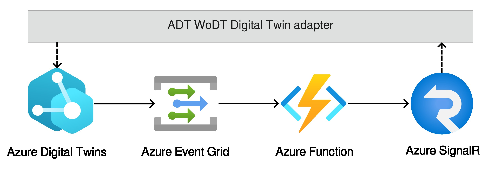

# Azure Function for Azure Digital Twins WoDT adapter

The Azure Function to deploy in the Azure pipeline to work with the [`azuredt-wodt-adapter`](https://github.com/Web-of-Digital-Twins/azuredt-wodt-adapter).

## Architecture
The minimal pipeline to make it works is composed by four services:
1. [**Azure Digital Twins**](https://learn.microsoft.com/en-us/azure/digital-twins/): it manages the Digital Twins to adapt.
2. [**Azure Event Grid**](https://learn.microsoft.com/en-us/azure/event-grid/): it routes events from Azure Digital Twins along the pipeline.
3. [***Azure Function***](https://learn.microsoft.com/en-us/azure/azure-functions/): it is the function of interest for this repo. It has the responsibility of creating a snapshot of the DT, starting from the event. The snapshot is then sent to the azure-wodt-adapter via the *Azure SignalR* service.
4. [**Azure SignalR**](https://learn.microsoft.com/en-us/azure/azure-signalr/): it is used to make data observable.

In the following, an image depicting this architecture:

## Function Configuration
It requires the following environmental variables:
- `ADT_SERVICE_URL`: the *Azure Digital Twins* instance url.
- `AzureSignalRConnectionString`: the *Azure SignalR* connection string.

## Useful resources
- [`azuredt-wodt-adapter`](https://github.com/Web-of-Digital-Twins/azuredt-wodt-adapter): the middleware that used in combination with this Azure Function enable to expose ADT DTs as WoDT Digital Twins.